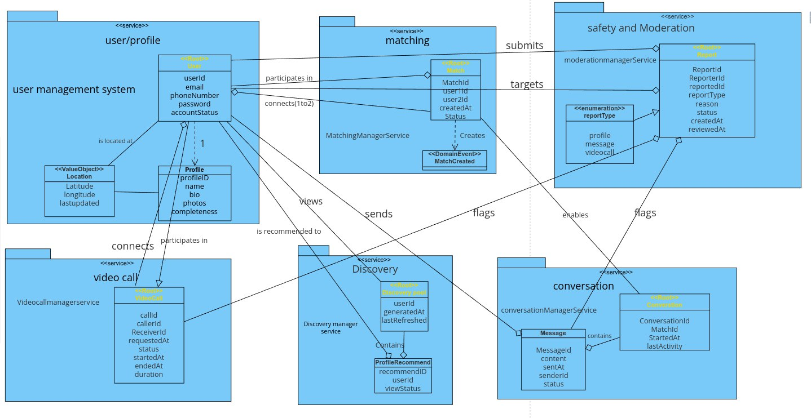

# Glossary of Domain Terms

## User Management

### User
An individual registered in the system looking to match with others.

### Profile
The collection of information, photos, and preferences that represents a user.

### Verification
The process of confirming a user's identity via email, phone, or social media.

### Account
A user's presence in the system, which can be in various states (verified, unverified).

### Social Connection
Links to social media accounts like Instagram or Spotify to enhance profile information.

### Mutual Friend
A person who is connected to both users through social media integration.

## Discovery & Matching

### Discovery Pool
The collection of potential profiles shown to a user based on preferences and location.

### Swipe
The action of indicating interest (right swipe) or disinterest (left swipe) in a profile.

### Like
A positive indication of interest in another user's profile.

### Dislike
A negative indication of interest in another user's profile.

### Match
The connection created when two users mutually like each other's profiles.

### Swipe Session
A period during which a user is actively viewing and swiping on profiles.

### Swipe Limit
The maximum number of profiles a user can like in a day.

## Communication

### Conversation
The exchange of messages between matched users.

### Message
A text communication sent between matched users.

### Message Notification
An alert informing a user they have received a new message.

### Video Call
A real-time video communication session between matched users.

### Video Call Request
An invitation to start a video call with a matched user.

### Video Call Notification
An alert informing a user they have received a video call request.

## Safety & Moderation

### Block
An action that prevents another user from seeing or interacting with the blocking user.

### Report
A user-submitted notification of inappropriate behavior or content.

### Flag
To mark content as potentially inappropriate for review.

### Ban
A permanent restriction of a user's access to the platform.

### Content Moderation
The process of reviewing and taking action on reported content.

### Prohibited Content
Material that violates the app's terms of service.

## Location & Preferences

### Location
The geographical position of a user, used for matching purposes.

### Match Distance
The maximum distance between users for them to appear in each other's discovery pools.

### Preference
User-defined criteria for potential matches (e.g., age range, gender).

## System Events

### Session
A period of user activity from login to logout.

### Login Attempt
An effort to access a user account with provided credentials.

### Rating
A user's evaluation of the app's quality.

# Domain Model Diagram

